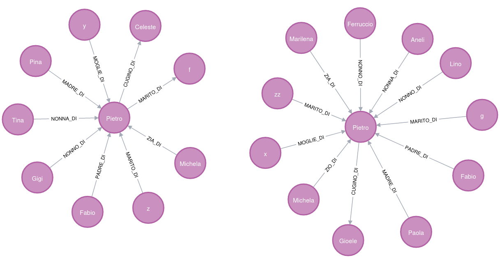

## Issues:

Con il caso di studio:

Abbiamo i seguenti problemi:

- *Michela* e' sia ZIO che ZIA, ma cio' non viene rilevato (sembra) –> **Problema rilevamento contraddizioni dirette**
- NONNO_DI non viene rilevato come CONTRADDITTORIO, nonostante lo sia –> **Problema con nuovi controlli su contraddizioni legate a limite**
- MADRE_DI non viene rilevata coma CONTRADDITTORIA, nonostante lo sia –> **Problema con nuovi controlli su contraddizioni di relazioni fisse**
- MARITO_DI rilevato come contraddittorio, nonostante non dovrebbe esserlo –> **Problema con nuovo controllo di scadenza**
- MOGLIE_DI rilevato come contraddittorio, nonostante non dovrebbe esserlo –> **Problema con nuovo controllo di scadenza**

- Contraddizione diretta NONNA_DI NONNO_DI rilevata senza esserci.

### Soluzioni/Motivazioni:

Dovrebbe essere un errore legato agli ID utilizzati e alle modifiche effettuate alla struttura e alle funzioni, dato che prima di effettuarle funzionava.

Analisi di casistiche precise fino a raggiungere una stabilita'.